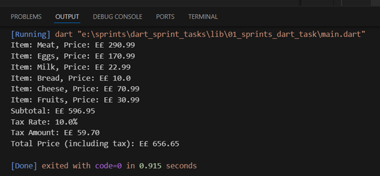

# 🛒 Grocery Price Calculator

A simple yet efficient Dart program that calculates the total cost of grocery items including taxes.

## 📝 Description

This program helps users calculate the total cost of their grocery shopping by maintaining a list of items with their respective prices and automatically calculating the applicable taxes. It's perfect for budget tracking and price estimation.

## 📋 Sample Output

 